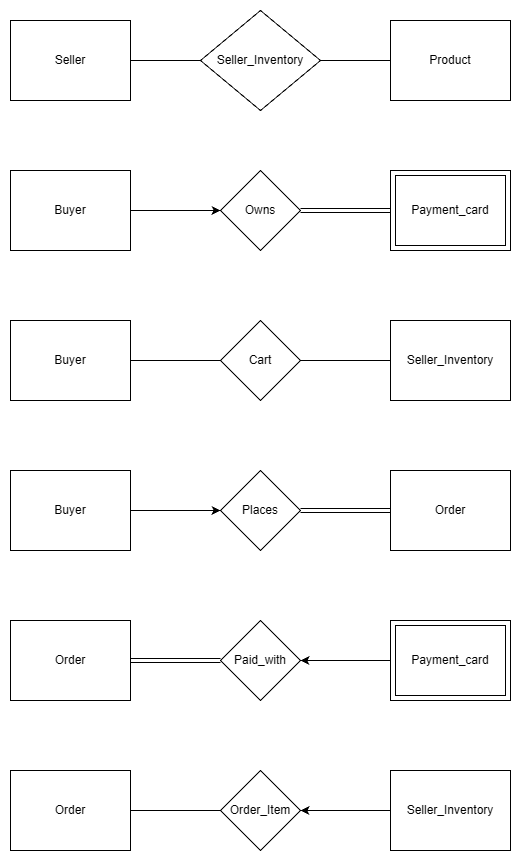

# 1. Problem statement & requirements

In this project, I am simulating a basic E-commerce platform. In this platform there are several things that need to be defined first:
* Seller: A person who sells different products on the platform
* Product: An object that is sold by a seller and bought by a buyer
* Buyer: A person who buys products sold on the platform

Requirements:
* Product Catalog: Easy sorting, categories.
* Shopping Cart & Viewing: Viewing products or add product into shopping cart.
* Payment: Can add multiple card but each corresponding to 1 address and 1 phone number.
* Order History: Every completed checkout is recorded permanently, including which card was charged and the price paid at the time of purchase.

Use Case:
* Seller wants to sell products
* Buyer wants to buy products of some category
* A product may be carried by more than one seller, each with their own stock level (marketplace model)
* A buyer's cart, once checked out, becomes a permanent order record

# 2. Identify the Entities and Relationships

## Strong entities

### Buyer

| Column | Keys |
|---|---|
| BID | PK |
| Name | |
---

### Seller

| Column | Keys |
|---|---|
| SID | PK |
| Store_name | |
| Email | |
| Phone | |
---

### Product

| Column | Keys |
|---|---|
| PID | PK |
| Product_name | |
| Category | |
| Price | |
---

### Order

| Column | Keys |
|---|---|
| OrderID | PK |
| BID | FK |
| CardID | FK |
| Order_date | |
| Total | |
---

## Weak entities

### Payment_Card

| Column | Keys |
|---|---|
| CardID | PK (partial key) |
| BID | FK |
| Card_Number | |
| Address | |
| Phone | |

## Relationships


| # | Relationship name | Cardinality | Participants | Attributes | Notes |
|---|---|---|---|---|---|
| 1 | **Seller_Inventory** | M:N | Seller &harr; Product | (SID FK, PID FK, Quantity, PRIMARY KEY(SID, PID)) |Relationship-with-attribute (`Quantity`). A seller can stock many products; a product can be stocked by many sellers. |
| 2 | **Owns** | 1:N | Buyer &rarr; Payment_Card | |A `Buyer` can have many `Payment_Card` but each `Payment_Card` can have 1 `Buyer`. |
| 3 | **Cart** | M:N | Buyer &harr; Seller_Inventory | (BID FK, SID FK, PID FK, Quantity, PRIMARY KEY(BID, SID, PID), FOREIGN KEY(SID, PID) REFERENCES Seller_Inventory(SID, PID)) | A `Seller` can sell to many different `Buyer`, vice versa. Each line references one buyer and one specific seller's listing. |
| 4 | **Places** | 1:N | Buyer &rarr; Order || A `Buyer` can place many `Order`; each `order` belongs to exactly one `buyer`. |
| 5 | **Paid_with** | N:1 | Order &rarr; Payment_Card || Each `Order` is charged to exactly one of the buyer's `Payment_Card` but a Buyer's `Payment_Card` can buy many `Order`. |
| 6 | **Order_Item** | M:N | Order &harr; Seller_Inventory | (OrderID FK, SID FK, PID FK, Quantity, Price_at_purchase,PRIMARY KEY(OrderID, SID, PID), FOREIGN KEY(SID, PID) REFERENCES Seller_Inventory(SID, PID))| Buyer can have many `Order` from many `Seller_Inventory` and vice versa. Permanent record of what `Cart` looked like at checkout. |

### Entity-Relationship summary 



## Relational Schemas

```
Buyer(BID PK, Name)
Seller(SID PK, Store_name, Email, Phone)
Product(PID PK, Product_name, Category, Price)
Seller_Inventory(SID FK, PID FK, Quantity, PRIMARY KEY(SID, PID))
Payment_Card(CardID PK, BID FK, Card_Number, Address, Phone)
Cart(BID FK, SID FK, PID FK, Quantity, PRIMARY KEY(BID, SID, PID),
     FOREIGN KEY(SID, PID) REFERENCES Seller_Inventory(SID, PID))
Order(OrderID PK, BID FK, CardID FK, Order_date, Total)
Order_Item(OrderID FK, SID FK, PID FK, Quantity, Price_at_purchase,
           PRIMARY KEY(OrderID, SID, PID),
           FOREIGN KEY(SID, PID) REFERENCES Seller_Inventory(SID, PID))
```
# 3. How to run this platform

## Step 1 — Install Git
 
You need Git to clone the repository.
 
**Check if you already have it:**
```bash
git --version
```
 
**If not installed:**
- **Windows:** Download from [git-scm.com/download/win](https://git-scm.com/download/win) and run the installer (defaults are fine).
- **macOS:** Run `git --version` in Terminal — macOS will prompt you to install the Xcode Command Line Tools if Git isn't present. Or install via Homebrew: `brew install git`.
- **Linux (Debian/Ubuntu):** `sudo apt update && sudo apt install git`
## Step 2 — Install Python
 
You need Python 3.12 or newer (the repo's `.python-version` pins 3.12).
 
**Check if you already have it:**
```bash
python3 --version
```
 
**If not installed:**
- **Windows:** Download from [python.org/downloads](https://www.python.org/downloads/). During install, check **"Add Python to PATH"**.
- **macOS:** Download from [python.org/downloads](https://www.python.org/downloads/), or `brew install python3`.
- **Linux (Debian/Ubuntu):** `sudo apt install python3`
**Verify `sqlite3` is bundled** (it ships with Python by default):
```bash
python3 -c "import sqlite3; print(sqlite3.sqlite_version)"
```
This should print a version number with no errors.
 
## Step 3 — Clone the repository
 
Open a terminal, navigate to wherever you want the project folder to live, then run:
 
```bash
git clone https://github.com/Thend911/DB-final-project.git
cd DB-final-project
```
 
This downloads all the repo's files into a new `DB-final-project` folder and moves you into it.
 
## Step 4 — Set up the database
 
The repo ships with a pre-built `ecommerce.db`, but it's best practice to rebuild it fresh from the `.sql` file so you know exactly what state it's in:
 
```bash
python3 init_db.py
```
 
You should see output confirming the tables and row counts, e.g.:
 
```
Database created at: /path/to/DB-final-project/ecommerce.db
Tables created (9): Buyer, Cart, Order, Order_Item, Payment_Card, Product, Seller, Seller_Inventory, sqlite_sequence
  - Buyer: 3 row(s)
  ...
```
 
No `pip install` or `uv sync` is required for this step — it only uses Python's built-in `sqlite3` module.
 
*(If you'd rather use `uv`, the repo's package manager of choice, you can run `uv sync` first to set up an isolated environment, then `uv run init_db.py` — but this is optional since there are no real third-party dependencies to install.)*
 
## Step 5 — Run the CLI
 
```bash
python3 main.py
```
 
You'll get an interactive menu:
 
```
==== Happy to assist with your shopping today! ====
1. View all products (by seller)
2. Browse products by category
3. Add product to cart
4. View my cart
5. Checkout
6. View order history
7. Run sample SQL reports (Requirement 5a)
0. Exit
```
 
Type a number and press Enter. Sample Buyer IDs to try: `1` (Alice Johnson), `2` (Brian Lee), `3` (Carla Gomez).
 
## Step 6 — Reset anytime
 
If your test data gets messy, just rebuild the database from the seed file again:
 
```bash
python3 init_db.py
```

> Note: if `python3` returns an error, try using command `python` instead